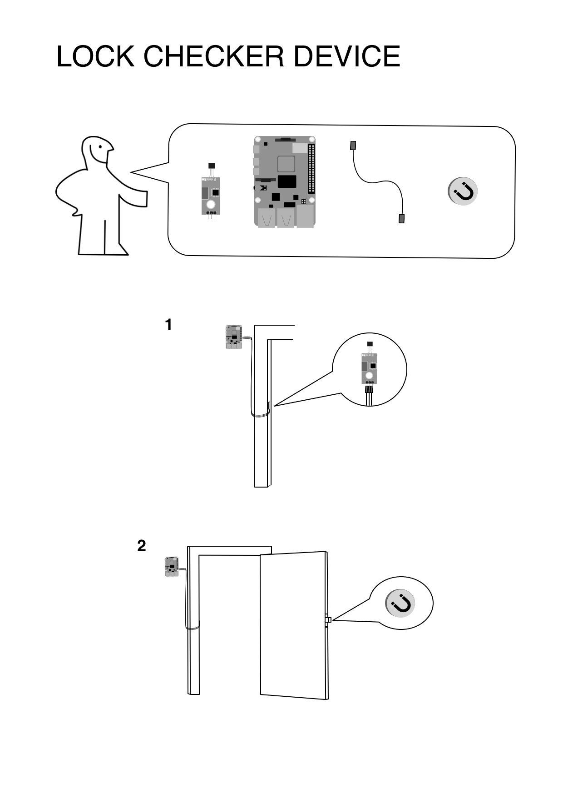

# README
Build a device that will check whether your door is locked, using a Raspberry PI, a hall effect sensor and a small but strong (preferably neodymium) magnet. It will store the results in a cloud Postgresql database of your choice (I chose Heroku for mine). The results can be displayed by a separate web application using the same database. You can find an example for the web app [here](https://github.com/menyhertfatyol/my-door-lock).
## Prerequisites

To set up your development environment, you'll need to following:

- [Docker](https://www.docker.com/)
- A Ruby version manager ([RVM](https://rvm.io/) or [Rbenv](https://github.com/sstephenson/rbenv) preferred)
- The appropriate version of Ruby, along with the Bundler gem

## Setting up

You'll need the PostgreSQL client library, so if you don't already have it installed then do so now:

```
sudo apt install libpq libpq-dev
```

Install the necessary gems:
```
bundle install
```

## Running the build
*The build will only run on a Raspberry PI!*

Start up Docker Compose:
```
docker-compose up -d
```

Run the migrations:
```
bundle exec rails db:migrate
```

To run the build:
```
bundle exec rake
```

## Production setup

You'll need the connection string to your PostgreSQL set in the ENV variable
```
ENV['DATABASE_URL']
```
